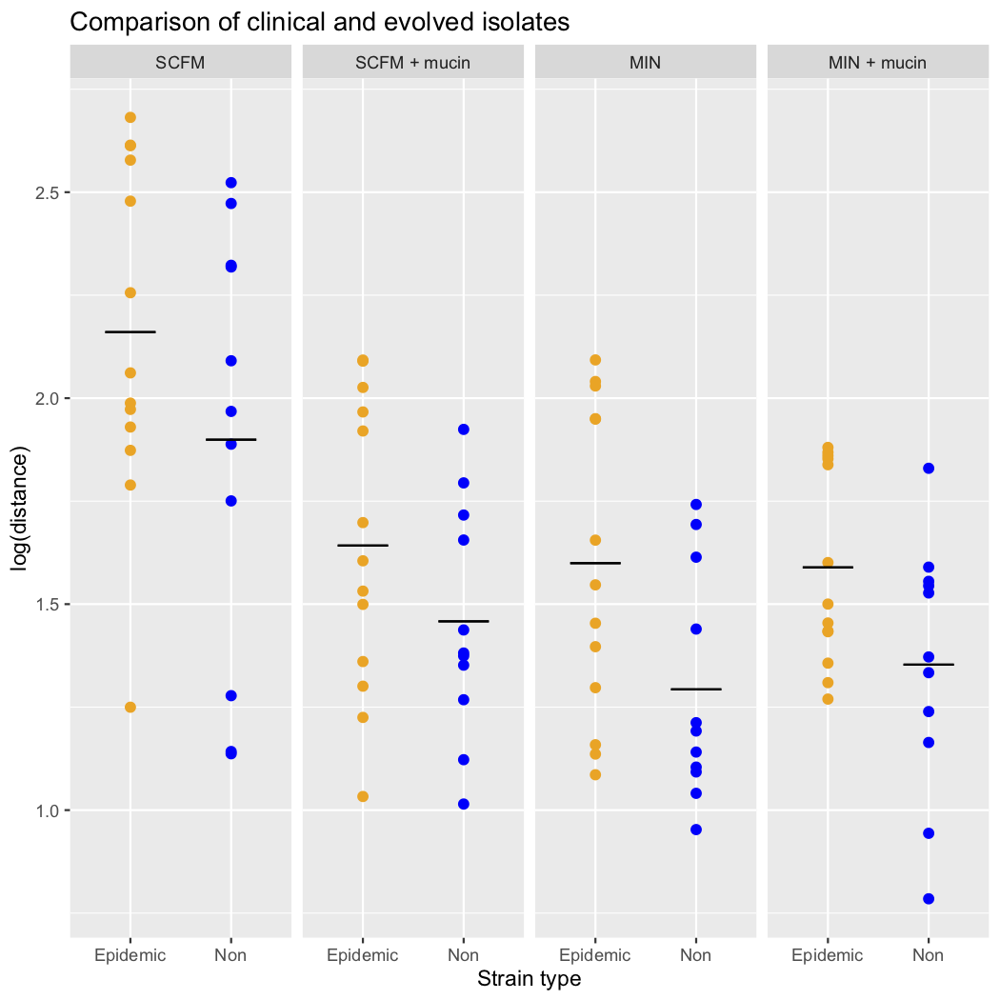

```{r setup, include=FALSE}
knitr::opts_chunk$set(echo = TRUE)
```

# Introduction

This data set comes from a short-term evolution experiment investigating adaptation of *Pseudomonas aeruginosa* to cystic fibrosis lung-like conditions. Several populations were evolved under four different environmental conditions and then compared to a set of strains isolated from clinical samples (ie. strains that had evolved in the human lung).

You can find the data set [here](https://www.dropbox.com/s/fflcupr2erl4f36/pa_clinical_distance.csv?dl=0) and you can read more about the experimental setup [here](https://doi.org/10.1073/pnas.1721270115).

# Task 1 - Plot

Use this data set to produce the plot below.



Your plot need not be identical, but should plot the same data with the same plot features (such as treatment names, facets, no legend, etc.).

Remember that there is often more than one way to do something in R, so if what you're trying isn't working, no need to feel attached to that strategy.

# Task 2 - Stats

The pattern in the plot above should be fairly clear, but we still need to 'do stats' on it. Use R to create a linear model with distance as the response variable and treatment and strain type as the explanatory variables. Use this model to answer the following questions:

1. Does treatment have a significant effect? 
2. Does strain type have a significant effect?
3. Is there a significant interaction between the two variables?


